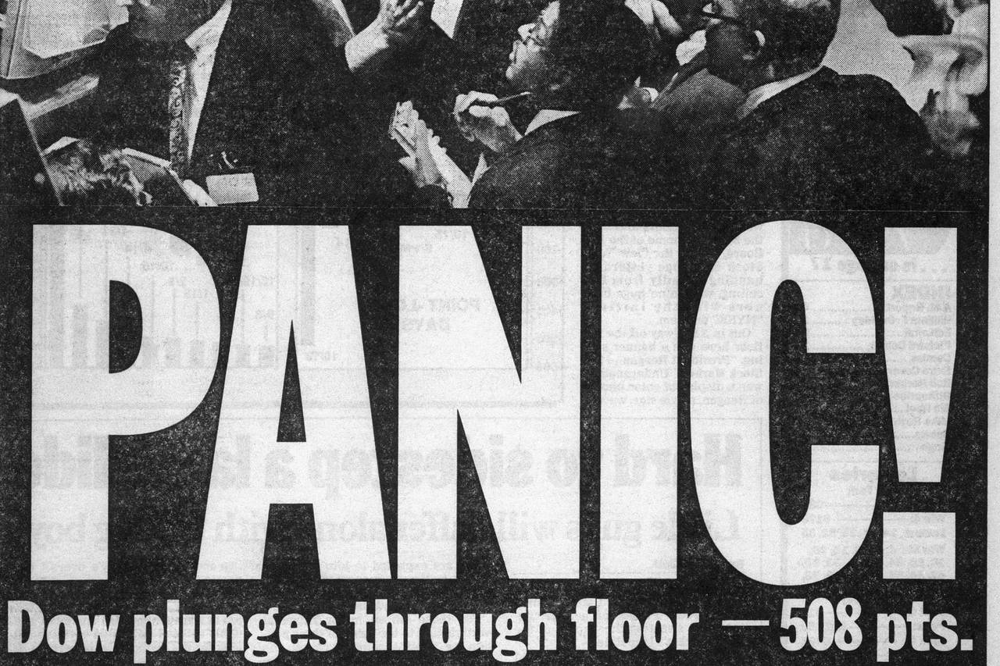
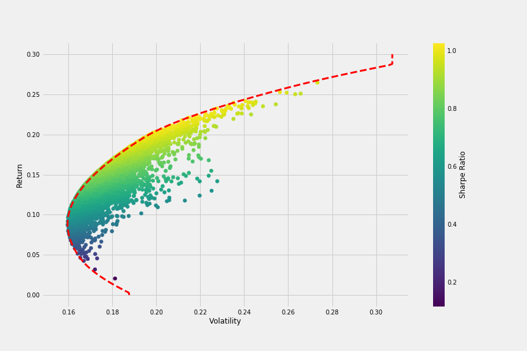

% Financial Markets
% Decision Making under Uncertainty
% Daniel Dimitrov, Juel Maximiliano, Amorpha Youth Foundation

The scientific method
--------

--------

How should we think about investments? 
--------

Return 
--------

--------

Risk and Uncertainty
--------

--------

Diversification
--------

--------

Efficiency
--------

--------

Constraints
--------

--------

Liquidity
--------

--------

Ethical considerations 
--------

Emotional biases
--------

--------

--------

Personal Investments
--------

- Lifetime savings

--------

Institutional investors
--------

- Pension funds

- Endowments

- Insurers

- Hedge Funds, etc. 

--------

The market is right ?
--------

- Random Walks

--------

Final thoughts? 
--------

- be smart
- be aware of your biases