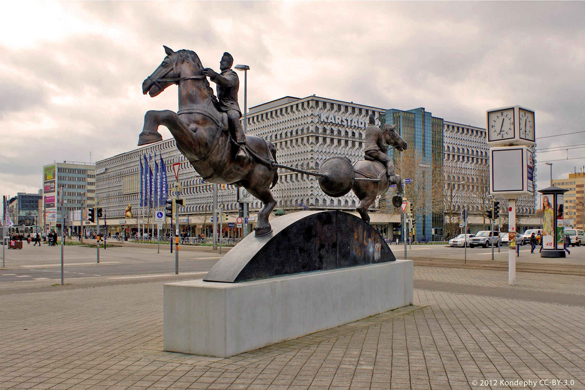
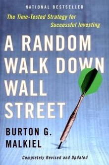
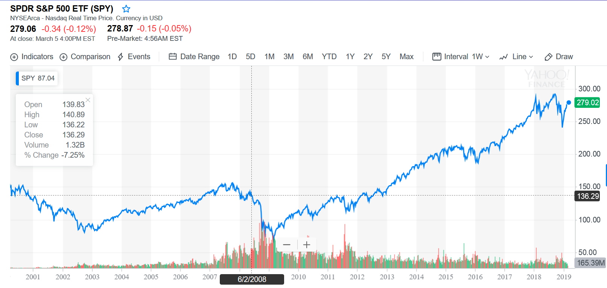

% Financial Markets and Uncertainty
% Amorpha Youth Foundation
% Daniel Dimitrov, Juel Maximiliano  

Who are the investors?
===============

Personal Investments
--------

- Lifetime savings

- Risk Aversion

- Equity premium puzzle

--------

Institutional investors
--------

- Pension funds

- Endowments, Sovereign Funds

- Insurers

- Hedge Funds, etc. 

Types of investments? 
==================

Asset Classes
--------

- Traditional 

	- Bonds
	- Equity 

--------	
	
- Alternative 

	- Private Equity
	- Hedge Funds
	- Property 
	- Art
	- Bitcoin (?) 
	
- Hedges (Derivatives)

	- Swaps, Options, Futures...
	
--------

Investing in Art? 

How should we think about investments? 
==================

The scientific method
--------

---------

The market is right ?
--------

- Market efficiency
- Random Walks

--------

$X_t = \mu_0 + X_{t-1} + \epsilon_t$, 

$$\epsilon_t \sim N(0,\sigma_{\epsilon}) $$

--------

--------

How do we build a portfolio? 
==================

Return 
--------

--------

Risk and Uncertainty
--------

--------

Diversification
--------

--------

Efficiency
--------

--------

Constraints
--------

--------

Liquidity
--------

--------

Ethical considerations 
--------

Emotional biases
--------

--------

==================

Final thoughts? 
--------

- be smart
- be aware of your biases
- recognize your constraints